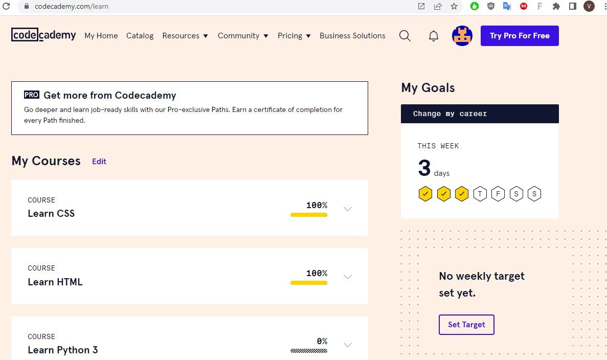

# Stage 0 

## Git та GitHub

Познайомився з Git на цьому курсі. На GitHub заходив лише для скачування публічних матеріалів (.zip архівом). Уявляю, наскільки крутий це інструмент, якщо навчитися професійно ним користуватися.

По учбовим матеріалам: курс на Coursera викладений лаконічно і зрозуміло. 

Гра learngitbranching.js.org на деяких етапах було доволі складною. Є цікаві моменти з `git rebase` і `git cherry-pick`, які можна розлядати як міні довідник і повернутися за потреби.

Чудова книжка
[Pro Git](https://git-scm.com/book/uk/v2 "Pro Git")

<!-- Важливо! Мені не вдалося налаштувати авторизацію з GitHub по HTTPS-протоколу за допомогою логіна і пароля- мабуть з-за Windows 7 (чи я чогось не зрозумів). Тому конектився за допомою SSH. Тут все є:[https://docs.github.com/en/authentication/connecting-to-github-with-ssh)  -->

<!--  -->

## Linux CLI, and HTTP
Команди Linux - ностальгія, для того, хто пам'ятає DOS. Просто і доступно. Додало впевненості для роботи в Git Bash.

#### Завдання:

Перший модуль

Другий модуль

Третій модуль

Четвертий модуль

 

______

Щодо прочитанного по HTTP - тільки практика допоможе засвоїти такий матеріал. 
## Git Collaboration

Сподобався матеріал "Прогресивне використання Git Remotes". Нарешті більш зрозумілим стало використання команд по роботі з віддаленими репозиторіями `git push`, `git fetch`, `git pull`. Анімація процесів - топ для навчання.

 В заключних лекціяx "Introduction to Git and GitHub" із цікавого відзначив би принципи командної роботи за допомогою GitHub. Залишаю собі посилання на майбутнє: [Bugzilla](https://www.bugzilla.org/)

#### Завдання:

learngitbranching_basic

learngitbranching_git_remote

Introduction to Git and GitHub_Week_3

Introduction to Git and GitHub_Week_4

 

## Intro to HTML and CSS

Матеріал на Coursera та Codecademy вдало один одного поєднують. Про щось більше поки-що говорити зарано.

#### Завдання:

Intro to HTML & CSS - Week 1

Intro to HTML & CSS - Week 2

Learn HTML @ Learn CSS

## Responsive Web Design

Відео від "Фрілансера по життю" дуже якісні.

#### Завдання:

Flexbox_froggy

Grid_garden

